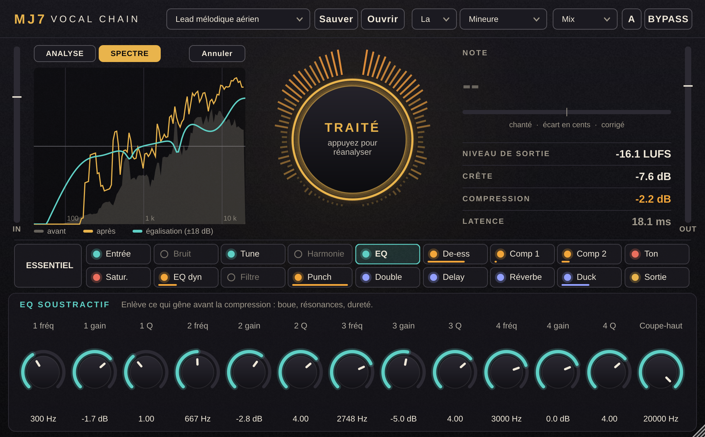

# MJ7 Vocal Chain

Tranche de voix complète pour FL Studio (VST3 sur Windows et Mac, Audio Unit sur Mac) : autotune, nettoyage,
réduction de bruit, harmoniseur 4 voix, EQ, de-esser, compression, saturation, doubleur, delay, réverbe et limiteur dans un seul plugin, avec un bouton
**ANALYSER** qui écoute la voix et règle la chaîne.



## Obtenir le plugin prêt à installer

Ce dépôt se compile tout seul sur GitHub, il n'y a rien à installer sur votre ordinateur.

1. Onglet **Actions** du dépôt : la compilation « Compiler le plugin » démarre à chaque envoi de fichiers
   (comptez 10 à 20 minutes). Pour la relancer à la main : **Run workflow**.
2. Quand elle est verte, ouvrez **Releases** (colonne de droite de la page d'accueil du dépôt) et téléchargez
   `MJ7-Vocal-Chain-Windows.zip` ou `MJ7-Vocal-Chain-macOS.zip`.
3. Suivez `INSTALLATION.txt`, présent dans chaque archive.

Dépôt public : compilations gratuites et illimitées. Dépôt privé : quota mensuel gratuit, dont la compilation
Mac consomme une bonne part à chaque lancement.

## La chaîne

| # | Module | Rôle |
|---|---|---|
| 1 | Entrée | Gain, coupe-bas, gate doux |
| 2 | Bruit | Réduction de bruit spectrale (profil appris par ANALYSER, sinon estimation automatique) |
| 3 | Tune | Autotune : tonalité, gamme, vitesse (0 ms = dur), quantité, transposition et formants ±12 demi-tons |
| 4 | Harmonie | 4 voix calées sur la gamme (tierce, quarte, quinte, sixte, octave), largeur, formants, mode Stack |
| 5 | EQ | 4 bandes soustractives + coupe-haut |
| 6 | De-ess | De-esser |
| 7 | Comp 1 | Compresseur rapide (crêtes) |
| 8 | Comp 2 | Compresseur lent (densité) |
| 9 | Ton | Grave, médium, présence, air |
| 10 | Satur. | Lampe, bande, écrêtage, fuzz, bits (suréchantillonnage x4 en mode Mix) |
| 11 | EQ dyn | 2 bandes dynamiques (dureté, aigus agressifs) |
| 12 | Filtre | Passe-haut / passe-bas résonants (effet téléphone) |
| 13 | Punch | Compression parallèle |
| 14 | Double | Doubleur stéréo |
| 15 | Delay | Libre ou calé sur le tempo, ping-pong, bouton THROW |
| 16 | Réverbe | Plate, hall, room, bouton THROW |
| 17 | Duck | Les effets baissent quand la voix chante |
| 18 | Sortie | Gain et limiteur |

## Mix et Tracking

| Mode | Latence | Usage |
|---|---|---|
| **Mix** | 18 ms (39 ms avec la réduction de bruit) | Mixage : qualité maximale, compensée par FL Studio |
| **Tracking** | 5 ms | Prise de voix avec l'autotune et les effets dans le casque. Pas de réduction de bruit ni de suréchantillonnage |

Le mode et la réduction de bruit sont des réglages de session : changer de style ne les modifie pas.

## Le bouton ANALYSER

Il écoute 12 secondes de voix, puis règle : gain d'entrée (voix à -18 dBFS), coupe-bas sous la note la plus
grave, seuil du gate au-dessus du bruit, coupes sur les résonances, fréquence et seuil du de-esser, seuils des
deux compresseurs et de l'EQ dynamique, grave / présence / air pour approcher la couleur du style choisi. Il
propose la tonalité et apprend le profil du bruit dans les silences. **INTENSITÉ** dose toutes ces corrections,
**Annuler** revient au style seul. Changer de style après une analyse refait le calcul pour le nouveau style,
sans réécouter. L'analyse est enregistrée avec le projet.

Les effets créatifs (saturation, harmonies, delay, réverbe, doubleur) viennent du style, pas de l'analyse. Les
courbes de couleur visées par chaque style sont des points de départ réglés à la main : à ajuster à l'oreille.

L'onglet **SPECTRE** montre la voix avant et après traitement, avec la courbe d'égalisation. Il s'ouvre tout
seul quand on sélectionne un module d'égalisation.

## Comment marchent l'autotune et les harmonies

La voix est découpée en grains de deux périodes, recollés à la période voulue (méthode PSOLA). L'espacement
des grains fixe la note, la vitesse de lecture dans chaque grain fixe les formants : les deux réglages sont
indépendants. Chaque voix d'harmonie est un deuxième jeu de grains, placé sur une note de la gamme.

## Limites connues

- Le moteur est fait pour une voix seule. Sur les consonnes, les voix très soufflées ou craquées, la période
  est mal définie et un léger grain peut apparaître.
- Les harmonies suivent la voix principale : elles n'ont ni vibrato ni placement propres.
- Réduction de bruit : à forte dose, léger « gargouillis » dans le fond. Elle retire un bruit constant
  (souffle, ventilation), pas les clics ni les voix de fond.
- En mode Tracking sous 100 Hz environ, la latence réduite laisse moins de marge au moteur : passez en Mix
  pour une voix très grave.
- Limiteur : contrôle la crête échantillon, pas la crête inter-échantillons (true peak).
- Le bypass n'est pas compensé en niveau.
- La tonalité proposée peut être la relative (La mineur / Do majeur) : à vérifier.

## Pour les développeurs

```
cmake -B build -DCMAKE_BUILD_TYPE=Release          # télécharge JUCE 8.0.9
cmake --build build --config Release --target MJ7VocalChain_VST3
```

- `Source/dsp/` : traitements en C++ pur, sans JUCE. Tests : `g++ -std=c++20 -O2 -I Source tests/dsp_tests.cpp -o t && ./t`
- `Source/Params.h` : liste unique des paramètres, des modules et des presets d'usine.
- `tests/host_test.cpp` : test d'intégration (`-DMJ7_BUILD_TESTS=ON`, cible `MJ7HostTest`).

Ne changez jamais les identifiants des paramètres ni les codes du plugin dans `CMakeLists.txt` : les projets
FL Studio existants en dépendent.

Le plugin utilise [JUCE](https://juce.com), sous licence AGPLv3 ou licence commerciale JUCE. Pour un usage
personnel, rien à faire. Si vous distribuez le plugin, il faut soit publier son code source (AGPLv3), soit
prendre une licence JUCE.
